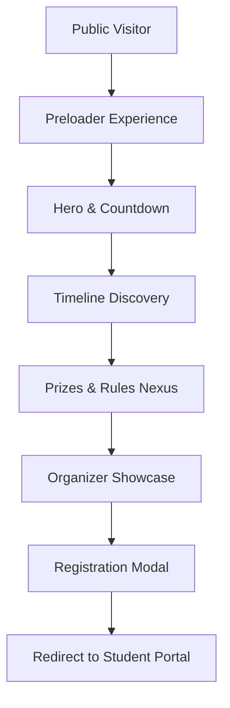

# 🌐 CodeCraft Landing Page


The **CodeCraft Landing Page** is the public face of the IIE HackLab's hackathon. It features a high-impact, neon-futuristic UI designed to captivate potential participants, showcase event details, and drive registrations.

---

## 🛠️ Tech Stack

- **Framework**: Astro 5 (Static Site Generation)
- **Styling**: Tailwind CSS 3 + Vanilla CSS (Custom neon effects)
- **Interactivity**: Vanilla JS (Loader, countdown, scroll reveals)
- **Optimization**: PostCSS & Autoprefixer

---

## 📂 Repository Structure

| Path | Purpose |
| :--- | :--- |
| `src/pages/` | Entry point and main page logic (`index.astro`) |
| `src/components/` | Reusable Astro components (e.g., `Navbar`) |
| `src/styles/` | Global design system and section-specific styles |
| `src/assets/` | Media assets (images, SVGs) |
| `public/` | Static public assets |

---

## 🔄 Way of Working (Logic Flow)



---

## 🚀 Getting Started

1. **Install Dependencies**:

   ```bash
   npm install
   ```

2. **Run Development Server**:

   ```bash
   npm run dev
   ```

3. **Build for Production**:

   ```bash
   npm run build
   ```

4. **Preview Build**:

   ```bash
   npm run preview
   ```

---

## 📝 Content Management

Most site content is managed via constants at the top of `src/pages/index.astro`. This includes:
- Event timeline
- Prize pools
- Participation rules
- Organizer profiles
